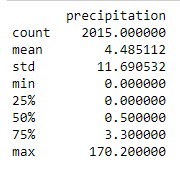

# SQLAlchemy Challenge - Hawaii Climate Analysis and Flask API

#### This project is a submission for Module 10 SQLAlchemy Challenge of the UWA Data Analysis Bootcamp. Its focus is on climate analysis for Hawaii using SQLAlchemy ORM queries, Pandas, and Matplotlib. The data is obtained from SQLite databases containing temperature and precipitation measurements from various weather stations in Hawaii. Finally, a Flask API is developed to serve the data analysis results.


## Table of Contents
- [Getting Started](#getting-started)
- [Data Analysis](#data-analysis)
- [Flask API](#flask-api)
- [Contributing](#contributing)
- [References](#references)

## Getting Started

These instructions will help you set up the project on your local machine for development and testing purposes.

### Prerequisites

Ensure you have Python 3.8+ installed on your system. You can check your Python version by running:

```python --version```

You will also need the following libraries:

- SQLAlchemy
- Flask
- Pandas
- Matplotlib 
- Numpy

You can install them using the included requirements.txt, or using pip:

```pip install -r requirements.txt```

```pip install sqlalchemy flask pandas matplotlib numpy```

## Running the Project

To run the web application, follow these steps:
1. Clone the repository
3. Run `python app.py` in the terminal
4. Open the web application in the browser at `http://localhost:5000`

## Data Analysis

The data analysis is conducted using SQLAlchemy ORM queries, Pandas, and Matplotlib. 

The analysis includes:

- Precipitation analysis for the last 12 months of available data.
- Summary statistics for the precipitation data.
- A list of weather stations and their activity in descending order.
- Temperature analysis for the most active station.





## Flask API

A Flask API has been created to show the data analysis results in JSON format, as well as all available routes.

The available API routes are:

- `/`: List all available routes.
- `/api/v1.0/precipitation`: Return a JSON dictionary of date and precipitation values.
- `/api/v1.0/stations`: Return a JSON list of weather stations.
- `/api/v1.0/tobs`: Return a JSON list of temperature observations for the most active station in the last 12 months.
- `/api/v1.0/<start>`: Return a JSON list of the minimum, average, and maximum temperature for all dates greater than or equal to the specified start date.
- `/api/v1.0/<start>/<end>`: Return a JSON list of the minimum, average, and maximum temperature for the specified date range.

## File Locations
```
Flask
   |-- app.py
Images
   |-- Precipitation-analysis.png
   |-- Temp-obs-data.png
   |-- most-active-stations.jpg
   |-- precipitation.jpg
   |-- surfs-up.jpg
Notebooks
   |-- climate_starter.ipynb
README.md
Requirements.txt
Resources
   |-- hawaii.sqlite
   |-- hawaii_measurements.csv
   |-- hawaii_stations.csv
app.py
README.md
requirements.txt
```
## Contributing

Pull requests are welcome. For major changes, please open an issue first to discuss what you would like to change.

## Acknowledgments
I would like to thank our bootcamp instructors for their guidance and support throughout this assignment.

## References
- Python: https://www.python.org/
- Pandas: https://pandas.pydata.org/
- Matplotlib: https://matplotlib.org/
- SQLAlchemy: https://www.sqlalchemy.org/
- Flask: https://flask.palletsprojects.com/


